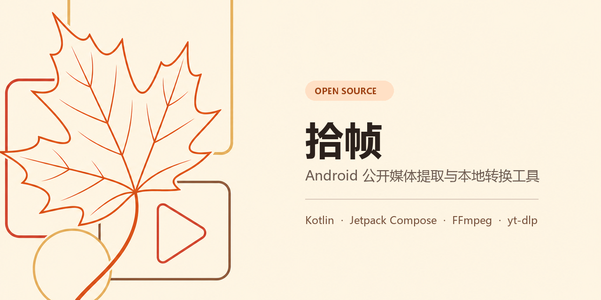

<p align="center">
  
</p>

<h1 align="center">拾帧</h1>

<p align="center">面向公开媒体与本地文件的 Android 提取、下载和格式转换工具</p>

<p align="center">
  <a href="https://github.com/fuu-start/Shizhen/actions/workflows/android.yml"></a>
  <a href="https://github.com/fuu-start/Shizhen/releases/latest"></a>
  <a href="LICENSE"></a>
  
</p>

<p align="center">
  <strong><a href="https://github.com/fuu-start/Shizhen/releases/latest">下载最新版 APK</a></strong>
  · <a href="#快速开始">安装与使用</a>
  · <a href="KNOWN_LIMITATIONS.md">已知限制</a>
  · <a href="https://github.com/fuu-start/Shizhen/issues">反馈问题</a>
</p>

拾帧使用 Kotlin、Jetpack Compose 和 Material 3 构建。它可以从分享文字中识别公开媒体链接，预览并下载可访问的视频、图片和音频，也能在手机本地完成视频转 GIF、GIF 转 MP4 和视频抽帧。

> [!IMPORTANT]
> 请只处理你拥有版权、已获授权或平台明确允许保存的内容。拾帧不提供 Cookie 导入、账号登录、付费绕过、DRM 绕过或访问控制规避能力。平台服务条款可能限制下载行为，使用者需自行确认并遵守。

## 功能亮点

- 从整段分享文字中提取 URL，并识别国内外常见公开媒体平台。
- 合并同一资源的不同清晰度，支持预览、后台下载、进度显示、打开和分享。
- 区分完整音频与“仅试听片段”，不把封面、预览或水印资源伪装成完整内容。
- 使用内置 FFmpeg 在本地完成视频转 GIF、GIF 转 MP4 和视频抽帧，不上传用户文件。
- 使用 Room 保存操作历史，并通过诊断中心导出经过脱敏的解析、下载和转换日志。
- Material 3 暖秋色界面，支持深色模式、系统分享接收和 Android 存储访问框架。

## 快速开始

1. 打开 [最新 Release](https://github.com/fuu-start/Shizhen/releases/latest)，下载文件名包含 `arm64-v8a` 的 APK。
2. 在 Android 8.0 或更高版本的 64 位手机上允许“安装未知应用”，然后打开 APK 安装。
3. 从浏览器或其他 App 分享公开链接到“拾帧”，或直接粘贴分享文字；应用不会在未经确认时自动解析或下载。
4. 平台页面结构和网络出口会影响解析结果。失败时请在“历史记录 → 诊断中心”导出报告，并通过 [Issue 模板](https://github.com/fuu-start/Shizhen/issues/new/choose) 反馈。

## 当前状态

当前正式版为 `1.0.8 (22)`。项目已在本仓库实际执行 `testDebugUnitTest`、`lintDebug` 和 `assembleDebug`；126 个 JVM 单元测试全部通过，Lint 为 0 errors。生成的 APK 仅包含 `arm64-v8a`，适用于主流 64 位 Android 手机，最低 Android 8.0（API 26）。

<details>
<summary><strong>展开查看完整实现清单</strong></summary>

已完成：

- 三个 Material 3 中文页面、统一暖秋色浅色/深色主题、系统无衬线字体、48dp 触控目标和安全区底部导航。
- 提取页按媒体类型合并资源：同一视频/音频的不同版本在一张卡片内单选，图集使用横向缩略图，媒体 URL、format id、编码和下载策略默认折叠；下载任务集中显示进度、取消、打开与分享。
- 转换页采用“选择文件 → 识别类型 → 选择功能 → 设置参数 → 选择保存位置 → 开始任务”的渐进流程，只显示当前文件可用的转换操作，并读取真实缩略图、大小、分辨率和时长。
- Launcher Icon 使用项目提供的猫咪秋日照片；照片及其裁切衍生资源只存在于 `drawable-nodpi` / `mipmap` 图标链路，任何 Composable 都不引用。应用内品牌装饰仅由 Compose Canvas 绘制的抽象猫爪和枫叶构成。
- AndroidX SplashScreen 显示当前 Launcher Icon 和随深浅色切换的纯色背景；随后仅在首次 Activity 创建时显示约 0.9 秒的 Compose 品牌开屏，Activity 重建和后台分享唤醒不会重复播放。三个业务页面布局保持不变。
- 从纯链接或整段分享文字提取首个 HTTP/HTTPS URL，校验格式并识别常见平台/域名。
- 接收系统 `ACTION_SEND` / `text/plain` 分享；冷启动和 `singleTop` 后台唤醒都会自动填入，但不会自动解析或下载。
- 插件式 `MediaParser` / `ParserRegistry`，包含抖音/西瓜视频、小红书、快手、网易云音乐和公开音乐页结构化解析器、真实的 yt-dlp Android 解析器、X/Twitter 单条状态结构化图片兜底和通用 HTTP/Open Graph/HTML 媒体解析器。
- Instagram、Facebook 和 YouTube 已进入正式平台识别与 yt-dlp 解析链路。YouTube 的 `youtu.be`、Shorts、Live 和嵌入链接会统一为单视频地址；Instagram/Facebook 的分享短链先经官方跳转展开，并自动移除常见追踪参数。
- Instagram/Facebook 视频优先使用 yt-dlp 的当前公开提取器；失败后只读取官方页面内当前帖的结构化状态或 Open Graph 媒体。Instagram 遇到明确的“帖子没有视频”结果时，会以忽略视频格式错误的只读模式重新取得最佳公开图片；轮播中只有部分子项报 `No video formats found` 时，应用改读单次轮播 JSON，跳过坏子项并保留每个可用视频，不再让一个坏子项拖垮整帖。新版 `data-sjs` 页面也会按 shortcode 对应的数字媒体 ID 隔离当前作品，避免采集推荐帖、头像和评论图片。公开页面直链下载会附带原作品 Referer。
- YouTube 视频流仍优先由 yt-dlp 提取；若平台按当前网络出口要求“确认不是机器人”，官方 oEmbed 即使还能返回标题、作者和封面，也不会覆盖真实的视频访问限制或把封面冒充为解析成功。已审阅 ReClip，并对诊断链接实际测试 yt-dlp `default`、`android_vr`、`web_embedded`、`web_safari` 和 `tv` 五种匿名客户端，全部被同一网络出口拒绝，因此没有加入只会延长等待的无效重试。应用不导入 Cookie、账号凭据或播放令牌。
- 豆包插件式解析器支持匿名公开 `/thread/` 和 `/video-sharing`：会解码 `data-fn-args` 属性中的 HTML 实体、嵌套 JSON 字符串和 Unicode URL，读取 `image_*_raw` / `originalImage`、公开图片和视频字段；存在原图时隐藏缩略图及 `_wm_` 水印派生地址。`video-sharing` 会识别官方匿名 `get_video_share_info` 响应中的 `data.play_info.main`，并在旧响应缺少播放字段时用 `video_id` 请求页面自身的 `get_play_info` 公开预览信息。若返回 URL 明确包含 `video_gen_watermark`，界面会如实标记“含平台水印”，但允许用户预览和下载，文件不会被伪装成无水印版本。实现同时注明了 `Qalxry/doubao-no-watermark` 的 GPL-3.0 字段兼容信息与 `ihmily/doubao-nomark` 的 MIT 公开播放响应兼容信息，但没有移植登录会话 XHR 拦截或像素处理。
- 小红书支持 `xhslink.cn` / `xhslink.com` 新旧分享短链，优先读取当前笔记的 `noteData` 或 `noteDetailMap`，只返回当前笔记图片、视频和封面，不采集相关推荐、评论或头像。新页面同时公开原图 CDN 基址和当前图片 `fileId` 时，优先使用对应原始尺寸图片，避开带“小红书”平台展示层的 `!h5_1080jpg` 版本；解析时会探测实际 JPEG/WebP 格式和大小。已知 HTTP 分享/CDN 地址会安全升级为 HTTPS。
- 网易云音乐支持 `163cn.tv` 歌曲短链和 `music.163.com` 公开单曲页；除 `music:duration` 外还会读取官方移动页 `window.REDUX_STATE.Song.dt`，避免分享页没有时长 meta 时漏标试听。解析器最多读取音频开头 64 KiB，结合 MP3 码率、文件总大小与目标歌曲时长识别明显较短的公开试听；命中时复用卡片、按钮、文件名和历史记录的“仅试听片段”标识。WorkManager 下载前会刷新临时 CDN 地址并强制使用 HTTPS，不使用 Cookie、登录态或第三方解析服务。
- QQ 音乐支持 `y.qq.com/n/ryqq/songDetail/...`、`c6.y.qq.com` 分享短链和带 `songmid` 的移动分享页。免费公开歌曲由 yt-dlp 官方 QQMusic 提取器返回真实音质列表；48/96/128 kbps 等选项代表不同音频码率与编码，不是视频清晰度。下载会优先使用解析阶段已验证的 QQ 官方 HTTPS 音频直链，直链失效时自动回退 yt-dlp 重新取源，并保持所选 MP3/M4A 原格式、不重新编码。若官方页面的 `pay_play=1` 表明只公开试听，应用会保留这段公开音频，但在卡片、音质说明、下载按钮、文件名和历史记录中明确标注“仅试听片段”，绝不冒充完整歌曲。
- 酷狗单曲分享页支持当前 `phpParam.song_info.data` 结构化状态，可读取歌曲名、歌手、封面、码率及页面直出的 `url` / `backup_url`。Android 端使用字符串感知的完整 JavaScript 对象扫描。酷狗 CDN 即使把 MP3 返回为 `application/octet-stream`，只要官方域名、`.mp3` 扩展名和真实 `ID3`/MPEG 音频签名同时匹配，仍会作为音频显示；HTML 或伪装文件不会放行，下载保存时 MIME 会纠正为 `audio/mpeg`。
- 快手支持 `v.kuaishou.com`、`chenzhongtech.com` 等公开分享页，按当前作品的 `photo.manifest.adaptationSet` 返回真实清晰度，兼容单图作品；不把背景音乐、作者头像或推荐作品混入结果。
- 哔哩哔哩、小红书、微博、快手、抖音、西瓜视频等短链先由 Android 网络栈展开，再将最终作品页交给对应解析器或 yt-dlp，避免内置 Python 在部分 VPN/蜂窝网络下无法解析短域名；B 站 HTTP 封面同时升级为 HTTPS。
- `v.douyin.com` 同时可能承载抖音和西瓜视频分享，因此输入阶段显示“抖音/西瓜视频短链”，网络跳转后再根据最终页面重新判定；`iesdouyin.com/xg/video/...` 会进入西瓜当前作品解析，不会继续误交给抖音解析器。
- 西瓜分享参数落地页若在部分蜂窝网络/VPN 下返回 HTTP 500，解析器会移除不稳定查询参数，依次尝试 `www.iesdouyin.com/xg/video`、`m.ixigua.com/xg/video`、`m.ixigua.com/video` 与 `m.ixigua.com/dx` 的当前作品公开页，并用移动/桌面请求头和对应官方 Referer 回退；不会因此把相关推荐混入结果。
- 平台识别覆盖 Instagram、Facebook、YouTube、X/Twitter、TikTok、Vimeo，以及豆包、抖音、快手、小红书、哔哩哔哩、微博、西瓜视频、AcFun、优酷、爱奇艺、芒果 TV、腾讯视频、好看视频、今日头条、梨视频、秒拍、美拍、搜狐、QQ 音乐、网易云音乐、酷狗、酷我、咪咕、网易视频和知乎。具有正式提取器的平台优先走专用解析器或 yt-dlp，其余使用受限的官方公开网页兜底，不能保证每个平台的每种链接都成功。
- 抖音图文帖优先读取页面公开的 `_ROUTER_DATA`：返回全部图片而不是把背景音乐误报为主资源，并排除 `download_url_list` 中路径明确含 `water` 的地址；短链在需要交给 yt-dlp 时先由 Android 网络栈展开。
- 抖音公开视频页若只返回 `/playwm/`，应用使用同一公开视频 ID 的 `/play/` 入口并固定请求公开 720p 源；界面明确区分“公开无水印播放源”和“公开原始源”，不会把页面作品尺寸冒充为实际下载分辨率。
- 解析视频、图片、GIF、封面、音频、标题、作者、清晰度、格式和可获得的文件大小。
- 图片/GIF 逐项预览、视频/音频流预览，以及推荐质量、音轨、编码和水印边界提示。
- 解析结果能确认视频包含音轨时，在资源列表末尾增加独立“音频”项和“下载音频”按钮：yt-dlp 来源选择最佳公开音轨并输出 M4A，公开视频直链则下载后使用本地 FFmpeg 提取音轨；无声视频和无音轨 GIF 不显示无效选项。
- 对抖音、TikTok、小红书等水印敏感平台检查 yt-dlp 返回的格式元数据；存在 `play_addr` / `Direct video` 等公开原始播放源时，只展示并下载这些源，排除明确标记为 `watermarked` 的格式。
- yt-dlp 解析规则每天最多检查一次官方稳定版更新；X/Twitter 默认 API 失败时会再尝试官方支持的 `syndication` API 模式。
- X/Twitter 的 `tweet_video` 动图在平台侧虽然是循环 MP4，应用会标记为 GIF，并在下载后使用本地 FFmpeg 真正转换成 `.gif`。
- WorkManager 后台下载、网络约束、重试、进度通知、存储空间检查和进程重启后的任务状态恢复。
- 已知平台的视频按用户选择的清晰度交给 yt-dlp 下载；分离的音视频由内置 FFmpeg 合并，不重新编码画面。
- Android 10+ 使用 MediaStore，视频、图片/GIF、音频分别保存到 `Movies`、`Pictures`、`Music` 下的 `MediaExtractorDemo`；其他文件进入 `Download/MediaExtractorDemo`。Android 8/9 使用应用专属外部目录与 FileProvider，不申请旧式全盘存储权限。
- 下载成功后打开或分享文件。
- Room 保存解析、下载和转换历史；支持详情、打开输出、删除单条和清空全部。
- 通过系统文件选择器选择媒体，通过系统创建文件/目录界面选择输出位置。
- 真实 FFmpeg 视频转 GIF（调色板、时间段、帧率、宽度、循环）、GIF 转 H.264 MP4（`yuv420p`）和按间隔提取 JPG/PNG。
- 转换和 yt-dlp 音视频合并共用 `ffmpeg-android 1.22` 提供的 FFmpeg 8.0.1 arm64 静态可执行文件；它不再依赖旧发行包缺失的 `libexpat.so.1` 或额外 `libc++_shared.so`。
- 视频转 GIF 和 GIF 转 MP4 均包含兼容模式重试；系统文件选择器返回通用 MIME 类型时，会结合扩展名识别 MP4、MKV、WebM、MOV、AVI、3GP、TS 和 GIF。
- 转换进度、取消、参数校验、空间检查、可读错误信息和应用异常退出后的中断历史标记。
- 应用内诊断中心：轮转保存解析器选择、候选格式筛选、yt-dlp 下载输出、预览失败代码、FFmpeg 命令/退出码和最近输出；支持复制、分享和清空报告。

</details>

更详细的边界请阅读 [KNOWN_LIMITATIONS.md](KNOWN_LIMITATIONS.md)，测试记录和真机清单见 [TESTING.md](TESTING.md)。

## 项目结构

```text
MediaExtractorDemo/
├── app/
│   ├── schemas/                       # Room 导出的数据库 schema
│   └── src/
│       ├── main/
│       │   ├── java/com/example/mediaextractor/
│       │   │   ├── data/
│       │   │   │   ├── converter/    # FFmpeg 真实实现
│       │   │   │   ├── database/     # Room Entity / DAO / Database
│       │   │   │   ├── download/     # WorkManager 下载仓库
│       │   │   │   └── repository/   # 历史仓库
│       │   │   ├── domain/
│       │   │   │   ├── converter/    # MediaConverter 与转换请求
│       │   │   │   ├── model/        # ParsedMedia / MediaItem
│       │   │   │   └── parser/       # MediaParser、注册表和解析器
│       │   │   ├── ui/               # navigation / extractor / converter / history
│       │   │   ├── util/             # URL、平台、诊断日志和文件 Intent 工具
│       │   │   └── worker/           # MediaDownloadWorker
│       │   └── res/                   # 中文资源、主题、图标、FileProvider 配置
│       └── test/                      # JVM 单元测试
├── build.gradle.kts
├── settings.gradle.kts
├── LICENSE                            # GPL-3.0
├── THIRD_PARTY_NOTICES.md
├── KNOWN_LIMITATIONS.md
└── TESTING.md
```

包名：`com.example.mediaextractor`

## Android Studio 运行

1. 安装当前可支持 Android Gradle Plugin 9.3.1 的 Android Studio，并使用 JDK 17。
2. 安装 Android SDK Platform 34、Platform Tools 和可用的 Build Tools。
3. 在 Android Studio 选择 **Open**，打开本目录 `MediaExtractorDemo`。
4. 如果 IDE 提示 SDK 路径无效，让 Android Studio 用本机 SDK 重写 `local.properties`；该文件本来就不应提交版本控制。
5. 等待 Gradle Sync 完成。
6. 连接已启用 USB 调试的 arm64-v8a Android 8.0+ 手机，选择 `app` 配置并点击 Run。

首次同步需要下载较大的 yt-dlp/Python 和 FFmpeg arm64 原生组件。项目仓库优先配置了可访问的 Maven 镜像，同时保留 Maven Central。

## 命令行编译

### Windows PowerShell

```powershell
$env:JAVA_HOME = "C:\path\to\jdk-17"
$env:ANDROID_SDK_ROOT = "C:\path\to\Android\Sdk"
.\gradlew.bat testDebugUnitTest assembleDebug
```

### macOS / Linux

```bash
export JAVA_HOME=/path/to/jdk-17
export ANDROID_SDK_ROOT=/path/to/android-sdk
./gradlew testDebugUnitTest assembleDebug
```

Debug APK 输出：

```text
app/build/outputs/apk/debug/app-debug.apk
```

### 正式签名构建

仓库不会包含发布密钥。维护者可在项目根目录创建已被 `.gitignore` 排除的 `keystore.properties`：

```properties
storeFile=/absolute/path/to/release-keystore.jks
storePassword=your-store-password
keyAlias=your-key-alias
keyPassword=your-key-password
```

随后执行 `./gradlew assembleRelease`。存在完整签名配置时会生成已签名 APK；没有该文件时，开源检出仍可正常执行 Debug 构建。密钥、密码和 `keystore.properties` 不得提交到版本控制。

## 真机使用

1. 安装 APK：`adb install -r app/build/outputs/apk/debug/app-debug.apk`。
2. 在“链接提取”页粘贴公开分享文字，确认识别出的 URL 后点“解析链接”。
3. 先看“推荐”标记、清晰度和音轨说明；图片/GIF 会直接显示，视频可点“预览这个版本”。只需要声音时，滑到资源列表末尾的“音频”项并点“下载音频”；否则按原方式下载所选资源。Android 13+ 首次使用时允许通知可获得前台进度通知。
4. 下载成功后使用“打开文件”或“分享”。Android 10+ 的视频在 `Movies/MediaExtractorDemo`，图片/GIF 在 `Pictures/MediaExtractorDemo`，音频在 `Music/MediaExtractorDemo`，其他文件在 `Download/MediaExtractorDemo`。
5. 在“格式转换”页选择本地视频或 GIF，设置参数，再由系统选择保存文件或输出目录。
6. 在“历史记录”页检查成功/失败状态、错误原因和输出 URI。
7. 如解析、预览、下载或转换失败，先保持失败现场，再进入“历史记录 → 诊断中心”，点击“刷新”后复制或分享报告。
8. 从浏览器或聊天应用分享一段 `text/plain` 文字到“拾帧”，确认应用只自动填入，没有自动解析或下载。

## Launcher Icon 说明

- 原始照片：`app/src/main/res/drawable-nodpi/app_icon_source.jpg`，仅作为图标源素材保存。
- 安全区版本：`app/src/main/res/drawable-nodpi/app_icon_foreground.png`，1024×1024 PNG；采用不拉伸的正方形主体裁切，四周保留围巾棕安全边，猫脸、枫叶和部分围巾位于主要蒙版区域。
- Android 8.0+ Adaptive Icon 通过 `mipmap-anydpi-v26/ic_launcher.xml` 与 `ic_launcher_round.xml` 引用照片前景和围巾棕背景；主题图标使用独立的抽象猫爪单色 VectorDrawable。
- Android 12+ 系统启动页使用独立的抽象枫叶 `ic_splash_brand.xml`，不会显示猫咪照片。
- 各密度 legacy `ic_launcher.png` / `ic_launcher_round.png` 已生成。不同厂商桌面蒙版仍建议真机查看；如需由视觉设计师进一步抠图，请提供 1024×1024 透明 PNG，关键内容放在中央约 672×672 px 安全区，外缘保留足够透明空间。

## 问题诊断

诊断报告的使用顺序：

1. 在新版本中重新执行一次有问题的链接解析、资源预览、下载或格式转换。
2. 不要清理应用数据，切换到“历史记录”，点击“诊断中心”。
3. 点击“刷新”，确认报告末尾出现对应的 `YT_DLP_PARSE`、`DOWNLOAD`、`PREVIEW` 或 `CONVERSION_FFMPEG` 记录。
4. 使用“分享”发送完整 `.txt` 报告；也可以点击“复制”后粘贴其中从 `parse_started` 或 `conversion_started` 开始的相关部分。

报告会记录解析器回退顺序、视频/纯音频格式数量、每个候选的格式 ID/编码/分辨率、水印分类、实际下载选择器、yt-dlp 最近 50 行输出、FFmpeg 首选与兼容命令、退出码及最近 40 行输出。报告还包含 Android 版本、CPU ABI、网络是否已验证以及缓存可用空间。

日志保存在应用私有目录，并以每份 512 KiB 轮转；分享时通过 FileProvider 临时授权读取，不要求存储权限。Cookie、Token、Authorization、URL 查询参数、URL fragment 和系统文件选择器 URI 会在写入前脱敏。诊断中心的“清空日志”只删除诊断记录，不删除历史或媒体文件。

## 架构说明

- `MediaParser` 是统一解析接口。`DoubaoPublicMediaParser` 只读取豆包匿名公开页内嵌资源；`DouyinStructuredMediaParser` 会在短链跳转后区分抖音与西瓜页面，`XiguaSsrDataExtractor` 只读取西瓜当前作品；`XiaohongshuStructuredMediaParser`、`KuaishouStructuredMediaParser`、`NeteaseMusicMediaParser` 和 `PublicMusicPageMediaParser` 读取当前作品/歌曲的公开结构化数据；`YtDlpMediaParser` 处理其余已知平台资源并原生支持 QQ 音乐公开音质；X/Twitter 失败时只尝试当前 `status` 页的结构化媒体元数据，不扫描整页图片。
- “公开原始源”表示平台/提取器明确返回的原始播放地址；“公开无水印播放源”表示已排除平台带水印下载入口，但可能是平台转码版本。两者都不能消除作者上传前已叠加在画面里的文字或标识。
- 通用解析器发起真实 HTTP 请求，跟随重定向，优先读取直链 Content-Type、Open Graph、Twitter meta、`video` 和 `audio`；只有没有结构化媒体时才读取 `article` / `main` / `figure` 内的图片，并过滤头像、图标和跟踪像素。
- `DownloadRepository` 把任务交给 WorkManager。已知平台使用 yt-dlp 按质量选择器重新取源和合并音视频；直接文件原样复制。单独下载音频时，yt-dlp 选取最佳公开音轨，直链视频由本地 FFmpeg 先尝试无损封装音轨、必要时转为 AAC。WorkManager 自身数据库保存任务状态，因此应用进程重建后仍可恢复显示。
- `MediaConverter` 与 `FfmpegMediaConverter` 分离，便于未来替换 FFmpeg 发行方式。当前实现调用 APK 内真正的 arm64 FFmpeg 可执行文件，不是复制文件或修改后缀。
- SAF 输入会先复制到应用缓存，FFmpeg 输出先在缓存生成，再写入用户通过系统选择器授予的目标 URI。缓存任务目录在成功、失败或取消后清理。
- Room 历史只保存操作元数据，不保存 Cookie、Token、账号或媒体正文。
- `DiagnosticLogger` 使用独立于 Room 的应用私有轮转文件，即使 WorkManager 在后台失败也能留下同一条任务的底层输出；导出时生成只读文本报告并通过 FileProvider 分享。

未来增加 `DouyinParser`、`TikTokParser`、`BilibiliParser`、`WeiboParser` 或 `XiaohongshuParser` 时，只需实现 `MediaParser` 并在 `ParserRegistry` 中注册。

## 依赖与许可证

由于集成的 `youtubedl-android` 采用 GPL-3.0，且 FFmpeg 静态二进制启用了 GPL 组件，拾帧源代码按 GPL-3.0 分发，完整条款见 [LICENSE](LICENSE)。主要第三方依赖、版本、版权与许可证链接见 [THIRD_PARTY_NOTICES.md](THIRD_PARTY_NOTICES.md)。

项目未使用其他应用的名称、图标、品牌素材、Cookie、Token 或私有密钥。
